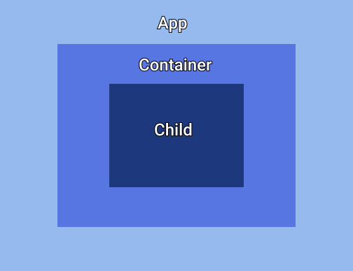

Before we get started, all of the code for this tutorial can be found in my GitHub Repository.

Let's begin with an Angular project which has a container component. We are going to display another component (let's call it child component) within the container component in this post.

We will be using the Angular CLI to generate modules and components, you can install Angular CLI by running the command below.

npm i @angular/cli

<h3>Create a Child Component</h3>

The first thing is to create the “child” component you plan to display. If you haven’t created the child component already, you can do so using the command below. We will display this child component within the container component.

ng generate component &lt;child-component-name&gt; 

<h3>Create the Child module</h3>

Navigate into your child component folder and create a module for your component using the command below. The module acts as a package which contains the component and carries everything that concerns the component.

ng generate module &lt;child-component-name&gt; --flat 

--flat is a command-line flag that ensures that the module is not created within a new folder.

Open child.module.ts file and import the child component using JavaScript import at the top of the file.

Note: Always import your component or modules using JavaScript before using them in the NgModule decorator.

Next, declare and export your child component within the NgModule in child.module.ts so it's made available to other components including the container component. child.module.ts should look a lot like this 👇🏾